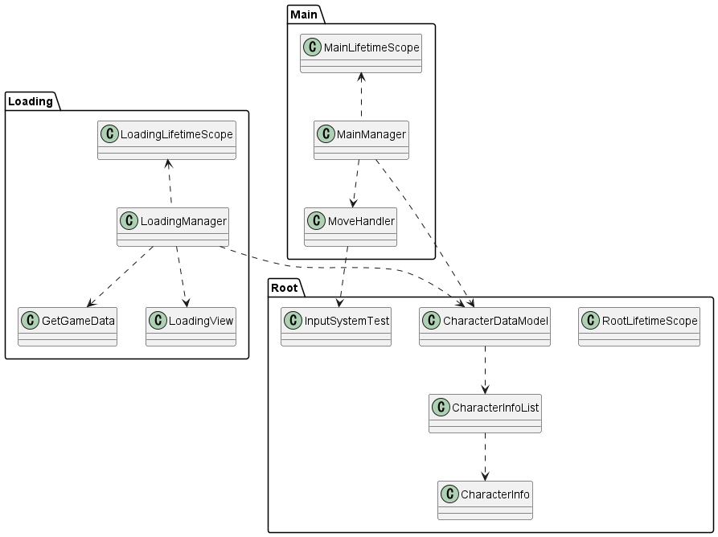

# UnityTemplateRepository

Unity Project template Repository

# Demo

GitHub : https://ayutaz.github.io/Unity-2D-feature-prototype/WebGL/WebGL/

Netfily : https://unity-2d-feature-prototype.netlify.app/

# requirements

* Unity 2021.3.0f1

# 検証内容

## Input System

* Action Mapによる シーン別操作方法の切り替え
* DIコンテナによるゲーム全体のインスタンス化

## DIコンテナ(VContainer)とマルチシーンを使ったシーン設計

* DIコンテナによるゲーム全体で使用するクラス(変数)のインスタンス化

## GSheetによるパラメータ調節とゲームスタート時のデータ更新

* 起動時のゲームパラメータのGoogle SpreadSheetからのパラメータ更新

一度 [ほかのリポジトリ](https://github.com/ayutaz/G-Sheet-Unity-Instead-AssetBundle)で検証を行っているため、上の3つの項目と合わせて動くかどうかの検証及び設計の考察

# クラス図及び処理の流れ

# Memo

* URPのGitHub Actions(Linux)はうごかない [参考](https://github.com/game-ci/unity-builder/issues/391)
* GitHub Pagesでなくても netlifyでも動く(他でも大丈夫そう)